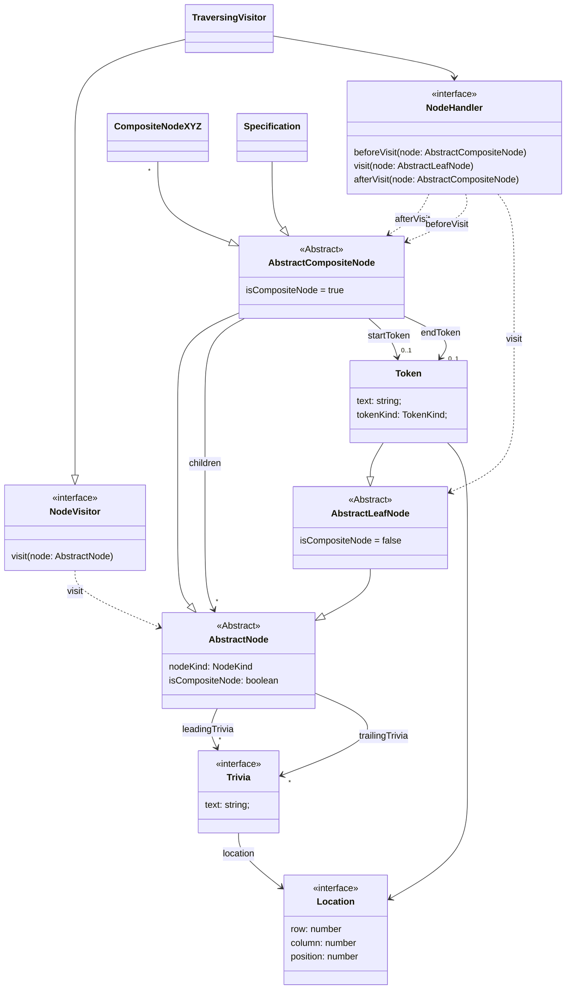

# mpeg-sdl-parser

> ISO/IEC 14496-34 Syntactic Description Language (MPEG SDL) parser implemented
> in TypeScript

[](https://github.com/mpeggroup/mpeg-sdl-parser/releases)
[](https://github.com/mpeggroup/mpeg-sdl-parser/actions/workflows/release-bun-library.yml)
[](https://mpeggroup.github.io/mpeg-sdl-parser/index.html)
[](https://github.com/mpeggroup/mpeg-sdl-parser/blob/main/LICENSE)

## Web Editor

A browser based web editor using this module is available at
https://github.com/MPEGGroup/mpeg-sdl-editor

## Module Usage

### Installation

**NOTE**: `@mpeggroup/mpeg-sdl-parser` is hosted on GitHub packages, so before
installing it as a dependency, you will need to configure usage of the GitHub
package registry and setup GitHub authentication.

Firstly, create a GitHub classic personal access token which has permission to
read packages.

**NPM**

Create an `.npmrc` file with the following content:

```
@mpeggroup:registry=https://npm.pkg.github.com`
```

Then login to the GitHub registry:

`npm login --scope=@mpeggroup --auth-type=legacy --registry=https://npm.pkg.github.com`

When prompted, specify:

- Username: `<your_github_username>`
- Password: `<your_classic_pat>`

Now you can add the module to your project:

`npm install @mpeggroup/mpeg-sdl-parser`

**BUN**

Create a `bunfig.toml` file with the following content:

```
[install.scopes]
"@mpeggroup" = { url = "https://npm.pkg.github.com/", token = "$NPM_GITHUB_TOKEN" }
```

Configure the token as an environment variable:

`export NPM_GITHUB_TOKEN=<your_classic_pat>`

Now you can add the module to your project:

`bun add @mpeggroup/mpeg-sdl-parser`

### Example Code

```javascript
import {
  SdlStringInput,
  createLenientSdlParser,
  collateParseErrors,
  buildAst,
  dispatchNodeHandler,
  prettyPrint
} from "@mpeggroup/mpeg-sdl-parser";

// Create a Lezer based SDL concrete syntax parser.
// This will create a lenient parser which recovers from parse errors and places error nodes in the parse tree.
// A strict parser which will throw a `SyntacticParseError` can be created with `createStrictSdlParser()`.
const parser = await createLenientSdlParser();

// Prepare the SDL input
const sdlStringInput = new SdlStringInput("class A{}");

// Parse SDL input and produce a parse tree
const sdlParseTree = sdlParser.parse(sdlStringInput);

// Traverse and print the parse tree
const cursor = sdlParseTree.cursor();
do {
  console.log(`Node ${cursor.name} from ${cursor.from} to ${cursor.to}`)
} while (cursor.next());

// Print any parsing errors by collating any error nodes in the parse tree
const parseErrors = collateParseErrors(sdlParseTree, sdlStringInput);

console.log(JSON.stringify(parseErrors);

// Build an Abstract Syntax Tree (AST) of the SDL specification from the concrete parse tree
// The third argument sets `lenient = true`. If this is not set or is `false`
// a `SyntacticParseError` will be thrown if the sdlParseTree contains parsing errors.
const specification = buildAst(sdlParseTree, sdlStringInput, true);

// Define a simple AST Node handler
class MyNodeHandler implements NodeHandler {
  beforeVisit(node: AbstractCompositeNode) {
    console.log("About to visit child nodes");
  }

  visit(node: AbstractLeafNode) {
    console.log("Visiting leaf node");
  }

  afterVisit(node: AbstractCompositeNode) {
    console.log("Finished visiting child nodes");
  }
}

// Dispatch the handler to visit all nodes in the AST
dispatchNodeHandler(specification, new MyNodeHandler());

// Pretty print the specification (retaining comments and handling parse errors)
let prettifiedSpecification = await prettyPrint(specification, sdlStringInput)

console.log(prettifiedSpecification);

// A Prettier (prettier.io) plugin for SDL is also available:
import * as prettier from "prettier/standalone.js";
import { prettierPluginSdl } from "@mpeggroup/mpeg-sdl-parser"; 

prettifiedSpecification = await prettier.format("class A{}", { 
  parser: "sdl",
  plugins: [prettierPluginSdl],
});

console.log(prettifiedSpecification);
```

## Development

Install dependencies:

`bun install`

Generate parser from grammar:

`bun run generate`

Test:

`bun test`

**NOTE**: The following tasks use Deno as it excels at these and Bun does not
currently provide such functionality:

Format:

`deno fmt`

Lint:

`deno lint index.ts src/ tests/`

Generate HTML API Documentation:

`deno doc --html --name=mpeg-sdl-parser index.ts`

## Documentation

### Overview

The concrete syntax parser is implemented using
[Lezer](https://lezer.codemirror.net) and the Lezer grammar defined in
[sdl.lezer.grammar](grammar/sdl.lezer.grammar). This framework was chosen as it:

* Provides robust error recovery whilst parsing.
* Integrates well with the web
based code editor framework [Codemirror](https://codemirror.net) which is used
in the [MPEG SDL Editor](https://github.com/MPEGGroup/mpeg-sdl-editor).

For reference purposes an SDL EBNF grammar is also provided in
[sdl.ebnf.grammar](grammar/sdl.ebnf.grammar)

The concrete syntax tree is then converted to an Abstract Syntax Tree (AST)
which is not tied to any underlying framework. The AST representation is used
for pretty printing and as such retains a "full fidelity" represenation of the
source i.e. including text location and trivia items (comments and blank lines).

### Abstract Syntax Tree Model



### API

Link to auto-generated API docs:

[API Documentation](https://mpeggroup.github.io/mpeg-sdl-parser)

### Debug Logging

Internal framework logging can be enabled by setting the `MPEG_SDL_PARSER_DEBUG`
environment variable. If running in a browser open the developer console and
run:

`localStorage.setItem("MPEG_SDL_PARSER_DEBUG", "true")`

The logging implementation will look for an object conforming to the `Logger`
interface and use it if found. If not found, a simple logging implementation
using the `console` object will be used.

## License

MIT © Flowscripter
